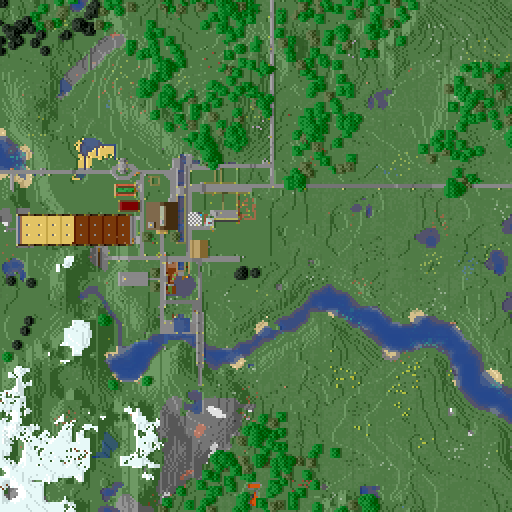

# Minecraft Image Generator



This generates map image from your Minecraft save data.

This software contains C++ re-implementation of [matcool/anvil-parser](https://github.com/matcool/anvil-parser)
and [twoolie/NBT](https://github.com/twoolie/NBT).

## Prerequirements

This project using functionally of C++17; you will need C++ compiler that support
C++17.

And, this software depends on following libraries:

- libpng
- zlib

also, this project uses CMake as build system so CMake (>= 3.15) is needed.

## Supported Environments

I'm working on this project on ArchLinux. I think you can build other GNU/Linux distros,
but not tested.

Also, I sometimes build this project on MSYS2 but not all revisions won't be able to built
on Windows. And, server functions are not supported on Windows
because it is too much bother (since Unix domain socket does not exist on Windows, of course).

## Installing Artifacts

You can build this project with following shell commands:

```shell
$ mkdir build; cd $_
$ cmake ..
$ make
```

After that, you'll get executable in `build/src/`.

If you want the executable to be in your binary directory,
you can also do `make install`.
I sure that CMake installs the executable in `/usr/local/bin` by default, on Unix.

## License

This project contains re-implementation of other software;
License for these will be subjected to authors of these.

Other components are written by Koki Fukuda and licensed under MIT License.
